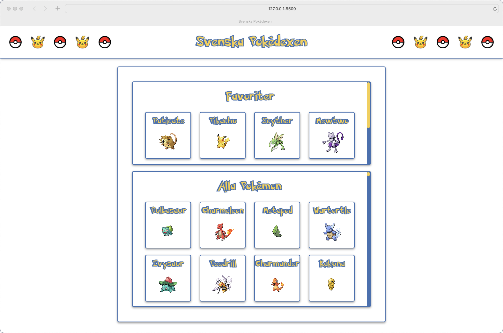

# pokedex-backend

### 1. Ladda ner både [pokedex-frontend](https://github.com/RobbanT/pokedex-frontend/tree/main) och [pokedex-backend](https://github.com/RobbanT/pokedex-backend/tree/main).
### 2. Starta upp MAMP och importera pokedex.sql (finns i pokedex-backend).
### 3. Öppna upp båda projekten i Visual Studio Code.
### 4. Starta pokedex-backend som en Spring Boot-applikation och pokedex-frontend som en Live Server.
### 5. Nu är det fritt fram att testa hur allt fungerar. Tänka på att man bara kan ha ett exemplar av varje Pokémon som favorit.
